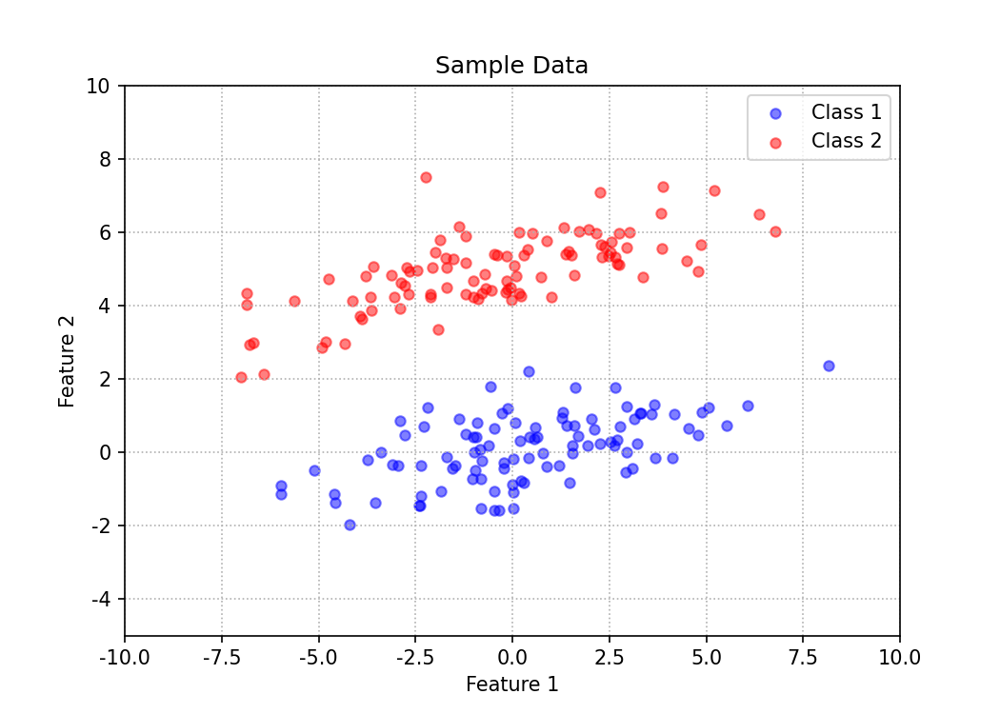
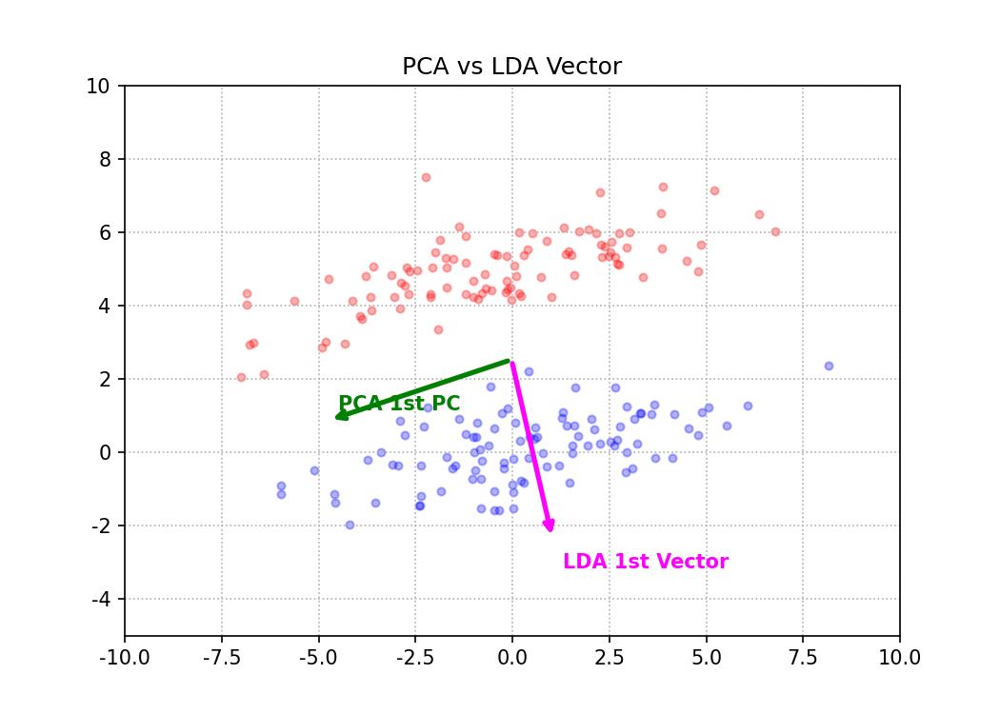
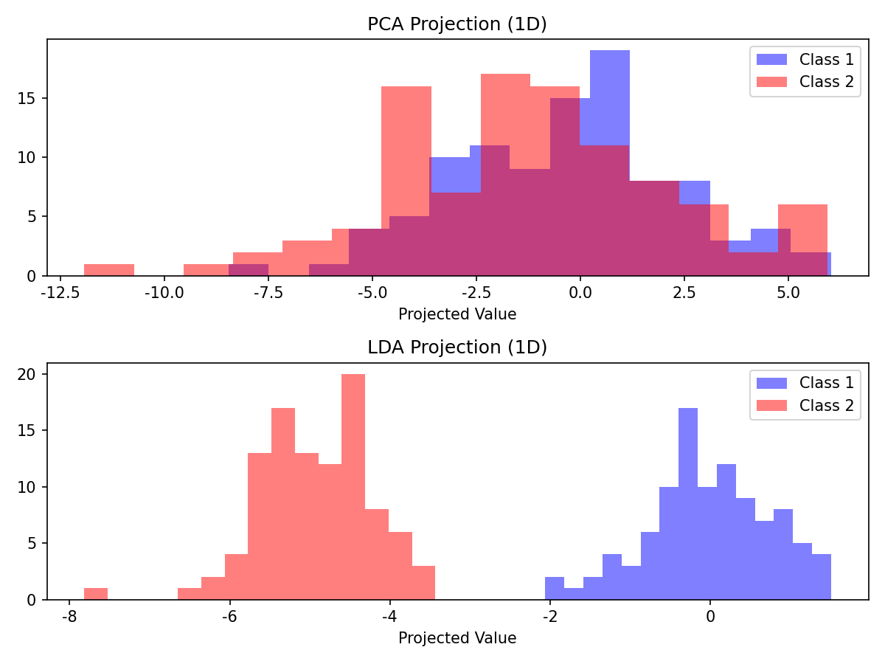
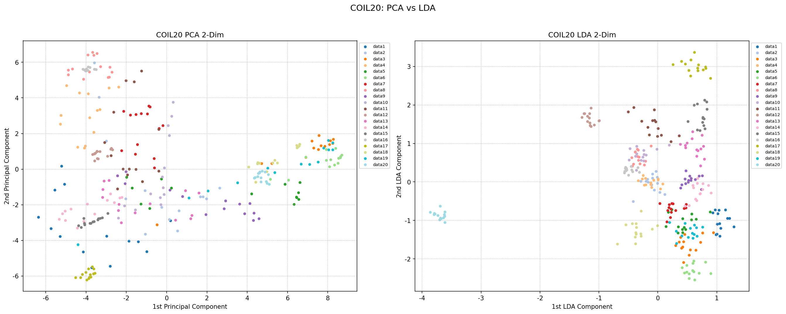

# 머신러닝특론 제 1차 과제 수행결과보고서

## 1. 과제 개요

이번 과제의 주제는 특징 추출 (feature extraction) 입니다. 특징 추출은, 데이터에서 중요한 정보만 뽑아내서 더 적은 수의 숫자로 표현하는 것입니다. 

과제에서 사용해야 하는 두 가지 방법이 있었습니다:
- PCA (Principal Component Analysis, 주성분 분석): 데이터를 줄이는 방법 중 하나
- LDA (Linear Discriminant Analysis, 선형 판별 분석): 데이터를 줄이되, 분류에 유리하게 줄이는 방법

중요한 조건으로, sklearn 같은 라이브러리에 이미 만들어져 있는 PCA/LDA 함수를 쓰면 안 되고, 수학 공식을 보고 직접 코드를 짜야 했습니다.

### 사용 환경
- 언어: Python 3
- 라이브러리: NumPy (행렬 계산용), Matplotlib (그래프 그리기용), h5py (데이터 파일 로드용)
- PCA, LDA는 직접 구현 (sklearn 미사용)

## 2. 과제를 시작하기 전에 - 개념을 이해하기까지의 과정

머신러닝에 대한 사전 지식이 거의 없는 상태에서 시작했기 때문에, 코드를 짜기 전에 먼저 개념을 이해하는 데 상당한 시간을 투자해야 했습니다. 아래는 제가 각 개념을 어떻게 이해하게 되었는지의 과정입니다.

### 차원 축소

차원 축소의 의미와 이를 왜 해야 하는가에 대해 확인해본 내용은 다음과 같았습니다.
- 데이터의 숫자 (차원)가 너무 많으면 계산이 느려지고 메모리도 많이 먹는다
- 사람이 그래프로 확인하려면 2차원이나 3차원이어야 하는데, 1024차원은 그릴 수가 없다
- 차원이 높을수록 분석이 어려워진다

쉽게 비유하면, 1,000쪽짜리 책의 내용을 핵심 요약 2줄로 줄이는 것과 비슷하다고 이해했습니다. 물론 2줄로 줄이면 정보 손실이 있겠지만, 핵심만 잘 뽑으면 대략적인 내용은 파악할 수 있는 것과 같이 말입니다.

### PCA 개념 이해하기

하늘에서 빌딩 숲을 내려다보면, 어떤 각도에서 찍느냐에 따라 빌딩들이 겹쳐 보일 수도 있고 잘 구분될 수도 있습니다. PCA는 빌딩들이 가장 덜 겹치는 각도, 즉 데이터가 가장 넓게 퍼져 보이는 방향을 자동으로 찾아주는 것입이다.

수학적으로 정리하면:
1. 모든 데이터의 평균을 구해서, 데이터를 원점 중심으로 옮긴다 (이걸 중심화라고 한다)
2. 데이터가 얼마나 퍼져있는지를 나타내는 공분산 행렬을 만든다
3. 이 공분산 행렬에서 고유값과 고유벡터를 구한다
4. 고유값이 가장 큰 고유벡터 = 데이터가 가장 넓게 퍼진 방향 = 첫 번째 주성분

여기서 고유값과 고유벡터가 또 생소했는데, 찾아보니 행렬을 특정 방향으로 곱했을 때 방향은 바뀌지 않고 크기만 바뀌는 특별한 벡터를 고유벡터라 하고, 그 크기 변화량을 고유값이라 한다고 합니다. PCA에서는 고유값이 클수록 그 방향으로 데이터가 많이 퍼져있다는 뜻이므로, 고유값이 큰 순서대로 주성분을 뽑는 것입니다.

### LDA 이해하기

PCA가 데이터 전체의 퍼짐을 기준으로 방향을 정한다면, LDA는 클래스 (그룹)를 가장 잘 나누는 방향을 기준으로 합니다.

쉽게 말하면:
- 같은 반 학생들끼리는 뭉치고 (within-class scatter, Sw를 최소화)
- 다른 반과는 멀리 떨어지는 (between-class scatter, Sb를 최대화)
- 그런 방향을 찾는 것이 LDA입니다.

수학적으로는:
1. 각 클래스의 평균과 전체 평균을 구한다
2. Sw (클래스 내 산포 행렬): 같은 클래스 안에서 데이터가 얼마나 퍼져있는지
3. Sb (클래스 간 산포 행렬): 클래스 평균들이 전체 평균에서 얼마나 떨어져있는지
4. Sw의 역행렬 x Sb의 고유벡터를 구하면, 그것이 최적의 분류 방향

### PCA vs LDA 핵심 차이

- PCA: 정답지 (레이블)를 안 보고 데이터 자체가 가장 넓게 퍼진 방향을 찾는다 (비지도 학습)
- LDA: 정답지 (레이블)를 보고 정답을 가장 잘 맞출 수 있는 방향을 찾는다 (지도 학습)

## 3. 문제 1 - 인공 데이터에 대한 PCA와 LDA (총 40점)

### 3.1 문제 1-(1): 데이터 생성 및 산점도 (10점)

#### 과제 요구사항 풀어보기

2차원 좌표 위에 점을 200개 찍을 것. 단, 두 그룹으로 나눠서 각각 100개씩, 주어진 규칙 (평균, 퍼짐 정도) 에 따라 찍을 것.

여기서 평균 (mu)은 그룹의 중심 위치이고, 공분산 (sigma)은 데이터가 얼마나, 어떤 모양으로 퍼지는지를 결정합니다.

#### 주어진 조건
- 클래스 1: 평균 mu1 = [0, 0], 공분산 Sigma = [[10, 2], [2, 1]]
- 클래스 2: 평균 mu2 = [0, 5], 공분산 Sigma = [[10, 2], [2, 1]]
- 각 클래스 100개씩 총 200개

이 조건을 보고 제가 이해한 것은:
- 두 그룹의 중심이 (0,0)과 (0,5)이므로, y축 방향 (feature 2)으로 5만큼 떨어져 있다
- 공분산 행렬의 [[10, 2], [2, 1]]에서, Feature 1 방향의 분산 (10)이 Feature 2 방향의 분산 (1)보다 10배 크므로, 데이터가 x축 방향으로 길쭉하게 퍼질 것이다
- 두 클래스의 공분산이 동일하므로, 퍼지는 모양은 같고 위치만 다르다

#### 구현 및 결과

np.random.multivariate_normal (평균, 공분산, 개수)를 사용하여 데이터를 생성했습니다. 처음에는 np.random.randn()으로 표준 정규분포를 만든 뒤 Cholesky 분해를 곱하는 방법도 시도해봤는데, multivariate_normal()이 훨씬 직관적이라 이 방법을 최종 선택했습니다.

실행 결과:
- Class 1 샘플 평균: [0.360, 0.103] (이론값 [0, 0]에 근사)
- Class 2 샘플 평균: [-0.412, 4.946] (이론값 [0, 5]에 근사)

산점도를 보면 예상대로:
- 두 클래스가 y축 방향으로는 어느 정도 분리되어 있지만 x축 방향으로는 크게 겹쳐 있습니다
- 데이터가 x축 방향으로 길쭉하게 퍼져 있는 것도 확인됩니다 (분산이 10이므로)

### 3.2 문제 1-(2): PCA 및 LDA 벡터 시각화 (20점)

#### 과제 요구사항 풀어보기

위에서 만든 데이터에 PCA와 LDA를 적용해서, 각각이 찾은 '최적의 방향'을 화살표로 그래프에 그려라.

즉, PCA가 데이터가 가장 넓게 퍼진 방향이라고 판단한 화살표와, LDA가 두 그룹을 가장 잘 나누는 방향이라고 판단한 화살표를 같은 그래프에 표시하는 것입니다.

#### PCA 구현 과정

앞서 정리한 PCA의 단계를 코드로 옮겼습니다:

1. 전체 데이터 200개의 평균을 구한다
2. 각 데이터에서 평균을 뺀다 (중심화)
   - 원점을 기준으로 방향을 찾아야 하므로
3. 중심화된 데이터의 공분산 행렬을 계산한다: C = (1/N) * X^T * X
4. 공분산 행렬의 고유값과 고유벡터를 구한다 (numpy의 linalg.eigh() 사용)
   - eigh()는 대칭 행렬 전용 함수인데, 공분산 행렬은 항상 대칭이라 이것을 사용
5. 가장 큰 고유값에 대응하는 고유벡터가 첫 번째 주성분 (PC1)

PCA 결과:
- 고유값: [9.424, 6.484]
- 첫 번째 주성분 벡터 (PC1): [-0.944, -0.331]
- PC1의 분산 설명 비율: 59.2%

해석: PC1이 x축에 거의 평행합니다 (x 성분 -0.944가 y 성분 -0.331보다 훨씬 큼). 이는 데이터가 x축 방향으로 가장 넓게 퍼져있기 때문에, PCA가 그 방향을 첫 번째 주성분으로 선택한 것입니다.

#### LDA 구현 과정

1. 각 클래스의 평균 (mean1, mean2)과 전체 평균(mean_all)을 구한다
2. Within-class Scatter Matrix(Sw)를 구한다
   - 각 그룹 안에서 데이터가 얼마나 흩어져 있는가를 구하기
   - 각 클래스에서 (데이터 - 클래스평균)을 구하고, 이것의 외적의 합을 구한다
3. Between-class Scatter Matrix (Sb)를 구한다
   - 쉽게 말해, 그룹의 중심점들이 전체 중심에서 얼마나 떨어져 있는가
   - (클래스평균 - 전체평균)의 외적에 샘플 수를 곱한 것의 합
4. Sw의 역행렬 x Sb를 구하고, 이것의 고유벡터를 구한다

LDA 결과:
- 고유값: [11.252, 0.000]
- 첫 번째 판별 벡터: [0.212, -0.977]
- 2클래스 문제이므로 유의미한 판별 벡터는 1개뿐 (클래스 수 - 1 = 1)

해석: LDA 벡터는 y축에 거의 평행합니다 (y 성분 -0.977이 x 성분 0.212보다 훨씬 큼). 두 클래스의 평균이 y축 방향으로 차이가 나므로 (mu1=[0,0], mu2=[0,5]), LDA가 y축 방향을 최적의 분류 방향으로 찾은 것입니다.

그림에서 초록색 화살표(PCA)는 데이터가 넓게 퍼진 x축 방향을 향하고, 마젠타색 화살표(LDA)는 두 클래스를 나누는 y축 방향을 향하는 것이 명확하게 보입니다. 두 화살표가 거의 직교하는 것이 인상적이었습니다.

### 3.3 문제 1-(3): PCA와 LDA 결과 비교 (10점)

#### 과제 요구사항 풀어보기

PCA 방향과 LDA 방향, 각각으로 데이터를 '눌러서' 1차원으로 만들었을 때, 어떤 차이가 있는지 비교하고 설명하라.

2차원 데이터를 특정 방향의 직선 위에 그림자를 떨어뜨리듯 투영하면 1차원 데이터가 됩니다. PCA 방향으로 투영한 결과와 LDA 방향으로 투영한 결과를 비교하면, 두 방법의 차이를 명확하게 볼 수 있습니다.

#### 결과 분석

PCA 투영 (위 그래프):
- 데이터가 넓게 퍼져있긴 하지만 (분산 보존은 잘 됨), 파란색 (class 1)과 빨간색 (class 2)이 상당히 겹쳐 있습니다.
- 이 방향으로 투영하면 두 클래스를 구분하기가 어렵습니다. 왜냐면 PCA는 전체 데이터가 넓게 퍼진 방향만 찾았지, 두 클래스를 나누는 데 좋은 방향을 찾은 게 아니기 때문입니다.

LDA 투영 (아래 그래프):
- 파란색과 빨간색이 명확하게 분리되어 있습니다.
- 이 방향으로 투영하면 두 클래스를 쉽게 구분할 수 있습니다. LDA는 처음부터 두 클래스를 가장 잘 나누는 방향을 목표로 찾았기 때문입니다.

#### 두 결과의 차이를 정리하면

| 구분 | PCA | LDA |
|------|-----|-----|
| 레이블 사용 여부 | 사용 안 함 (비지도) | 사용함 (지도) |
| 최적화 목표 | 데이터 전체의 분산 최대 보존 | 클래스 간 분리 최대화 |
| 찾은 방향 | x축 방향 (분산이 큰 방향) | y축 방향 (클래스가 나뉘는 방향) |
| 투영 후 분류 가능? | 어려움 (겹침이 심함) | 용이함 (잘 분리됨) |

이 실험에서 깨달은 핵심:
이 데이터에서는 데이터가 가장 넓게 퍼진 방향 (x축)과 클래스가 나뉘는 방향 (y축)이 서로 다릅니다. 이런 경우 PCA는 분류에 쓸모없는 방향을 골라버리고, LDA만이 분류에 유용한 방향을 찾아줍니다. 만약 두 방향이 같았다면, PCA와 LDA의 결과가 비슷했을 것입니다.

## 4. 문제 2 - COIL20 데이터에 대한 PCA와 LDA (총 60점)

### 4.1 데이터 이해

#### COIL20 개념

COIL20(Columbia Object Image Library)은 컬럼비아 대학에서 만든 이미지 데이터셋입니다. 20개의 물체를 회전대 위에 놓고 5도씩 회전하면서 촬영한 것입니다. 오리 인형, 자동차 장난감, 약병 등 다양한 물체가 포함되어 있습니다.

과제에서 사용하는 데이터의 구조:
- 학습 데이터 (X): 280개 샘플 (20개 물체 x 물체당 14장)
- 각 이미지: 32 * 32 = 1024개의 픽셀값으로 이루어진 벡터
- 레이블(Y): 1 ~ 20 (어떤 물체인지를 나타내는 숫자)

쉽게 말하면, 32 * 32 크기의 이미지 한 장을 한 줄로 쭉 펴서 1,024개의 숫자로 만든 것이 하나의 데이터 포인트입니다.

#### 과제 요구사항 풀어보기

1,024차원 (숫자 1,024개)인 이미지 데이터를, PCA와 LDA를 사용해서 각각 2차원 (숫자 2개)으로 줄이고, 2차원 그래프에 점으로 찍어라. 이때 20개 물체 클래스가 구분되도록 색을 다르게 칠해라.

### 4.2 PCA 2차원 특징 추출

문제 1에서 구현한 PCA를 그대로 1,024차원 데이터에 적용했습니다. 단계는 동일합니다:
1. 280개 데이터의 평균을 구하고 중심화
2. 1,024 * 1,024 공분산 행렬을 만들고 고유값 분해
3. 상위 2개 고유벡터를 사용해 2차원으로 투영

여기서 한 가지 확인해본 것이 정보보존율입니다. 1,024차원을 2차원으로 줄이면 정보가 얼마나 남는지가 궁금했습니다.

정보보존율 분석 결과:
- 2차원으로 줄이면: 정보의 약 43%만 보존 (많이 손실됨)
- 95%를 보존하려면: 61개 주성분이 필요
- 즉, 1,024차원 → 61차원으로 줄여도 정보의 95%는 유지된다는 뜻입니다

이것을 보고 1,024개의 숫자 중 상당수는 사실 중복된 정보라는 것을 확인했습니다.

### 4.3 LDA 2차원 특징 추출 (PCA 95% 전처리 후)

#### 과제 수행 중 애로사항

LDA를 구현하려면 Sw(클래스 내 산포 행렬)의 역행렬을 구해야 합니다. 그런데 COIL20 데이터에 바로 LDA를 적용하면 역행렬이 존재하지 않는다는 에러가 나왔습니다.

왜 그런지 한참 찾아봤더니:
- Sw는 1024 * 1024 크기의 행렬인데, 역행렬을 구하려면 full rank여야 합니다
- Sw의 rank는 최대 N - C = 280 - 20 = 260인데, 행렬 크기는 1024이므로 rank가 부족합니다
- 쉽게 말하면, 데이터 수보다 차원 수가 많아서 행렬이 제대로 채워지지 않는 것입니다
- 이것을 특이행렬(singular matrix) 문제라고 한다는 것도 이때 처음 알았습니다

#### 해결 방법: PCA로 먼저 차원을 줄이자

과제 지시문에도 정보보존율 95%로 PCA를 우선 수행하라고 되어 있었는데, 그 이유가 바로 이것이었습니다. PCA로 1024차원을 61차원으로 먼저 줄이면, Sw가 61 * 61 크기가 되므로 역행렬을 구할 수 있게 됩니다.

LDA 수행 과정:
1. PCA로 1024차원 → 61차원 축소 (정보보존율 95.10%)
2. 61차원 공간에서 Sw (클래스 내 산포)와 Sb (클래스 간 산포)를 계산
3. Sw의 역행렬 x Sb의 고유벡터를 구함
4. 상위 2개 고유벡터를 사용해 2차원으로 최종 투영

추가로, Sw의 역행렬을 구할 때 수치적으로 불안정한 경우가 있어서, Sw의 대각선에 아주 작은 값 (epsilon = 0.000001)을 더해주는 정규화(regularization) 기법도 적용했습니다. 이것도 처음에 에러가 나서 검색하다가 알게 된 것입니다.

결과: 유의미한 판별 벡터 수: 19개 (클래스 수 - 1 = 20 - 1 = 19)

### 4.4 PCA와 LDA 2차원 출력 결과 비교

PCA 결과 (좌측):
- 일부 클래스는 어느 정도 군집을 형성하고 있지만, 전반적으로 클래스들이 많이 겹쳐 있습니다.
- PCA는 클래스가 뭔지 모르는 상태에서 전체적으로 데이터가 넓게 퍼지도록 축소한 것이라, 분류 관점에서는 한계가 있습니다.
- 첫 2개 주성분으로는 전체 분산의 43%만 보존되기 때문에 정보 손실도 큽니다.

LDA 결과 (우측):
- PCA에 비해 같은 클래스의 데이터끼리 더 뭉쳐 있고, 다른 클래스와의 분리도 더 명확합니다.
- LDA가 어떤 점이 어떤 물체인지를 아는 상태에서, 물체를 가장 잘 구분하는 방향으로 축소했기 때문입니다.
- 다만 20개 클래스를 단 2차원에 표현하는 것은 한계가 있어서, 일부 클래스는 여전히 겹치는 부분이 있습니다.

문제 1에서 인공 데이터로 실험한 결과와 같은 패턴이 실제 이미지 데이터에서도 나타나는 것이 흥미로웠습니다. PCA는 전체 구조 보존에, LDA는 분류에 각각 더 적합합니다.

---

## 5. 전체 결론 및 느낀 점

### 핵심 결론
1. PCA는 레이블 없이 데이터 자체의 분산을 보존하는 방향을 찾고, LDA는 레이블을 활용해 분류에 최적화된 방향을 찾습니다.
2. 분류 목적이라면 LDA가 PCA보다 일반적으로 더 효과적입니다.
3. 고차원 데이터에서 LDA를 적용할 때는 Sw의 특이행렬 문제가 생길 수 있으며, PCA로 먼저 차원을 축소하면 이를 해결할 수 있습니다.

### 이 과제를 하면서 배운 것들
- 차원 축소가 단순히 숫자를 줄이는 것이 아니라, 어떤 기준으로 정보를 압축하느냐가 핵심이라는 것을 깨달았습니다.
- 교재의 수식을 코드로 직접 옮기면서, 공분산 행렬이나 고유값 분해 같은 선형대수 개념이 실제로 어떻게 활용되는지 체감할 수 있었습니다.
- 이론에서는 간단해 보이던 역행렬 문제가, 실제 고차원 데이터에서는 특이행렬 문제로 이어진다는 것을 처음 경험했습니다.
- PCA를 먼저 하고 LDA를 하라는 과제 지시의 이유가, 단순히 절차가 아니라 수학적 필연이었다는 것을 이해했습니다.

### 아쉬운 점 및 궁금한 점
- SVD (특이값 분해)를 사용한 더 효율적인 PCA 구현 방법이 있다고 하는데, 이번에는 시간 관계상 시도하지 못했습니다.
- LDA에서 regularization 값 (epsilon)을 어떻게 정하는 것이 최적인지는 아직 잘 모르겠습니다.
- 2차원이 아닌 3차원으로 투영하면 결과가 어떻게 달라지는지도 궁금합니다.
